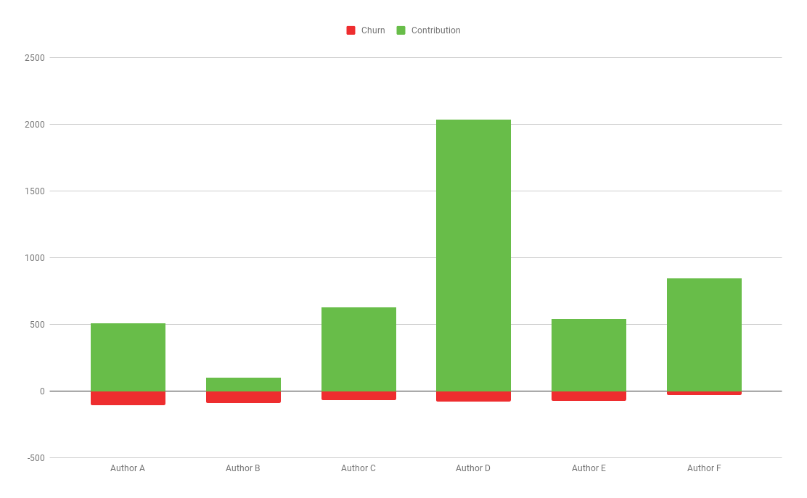

# True Git Code Churn
A Python script to compute "true" code churn of a Git repository. Especially useful for software teams.

Code churn has several definitions, the one that to me provides the most value as a metric is:

> "Code churn is when an engineer rewrites their own code in a short period of time."

*Reference: https://blog.gitprime.com/why-code-churn-matters/*

Solutions that I've found online looked at changes to files irrespective whether these are new changes or edits to existing files. Hence this solution that segments code edits (churn) with new code changes (contribution).

# How it works
This script looks at a range of commits per author. For each commit it book-keeps the files that were changed along with the lines of code (LOC) for each file. LOC are kept in a sparse structure and changes per LOC are taken into account as the program loops. When a change to the same LOC is detected it updates this separately to bookkeep the true code churn.
Result is a print with aggregated contribution and churn per author for a given time period.

Tested with Python version 3.7.6 Git version 2.25.0

# Usage
basic usage:
```bash
python3 ./gitcodechurn.py --before=2020-03-01 --after=2019-11-29  --dir=/Users/myname/myrepo
```
to generate an html file (codechurns.html)  that visualizes the result:
```bash
python3 ./gitcodechurn.py --before=2020-03-01 --after=2019-11-29  --dir=/Users/myname/myrepo --gui=true
```
# Output
```bash
...
author:  Max
contribution:  5530
churn:  -2176
author:  Jeff
contribution:  5370
churn:  -626
author:  Murph
contribution:  3429
churn:  -576
...
```
Outputs can be used as part of a pipeline that generates bar charts for reports:

